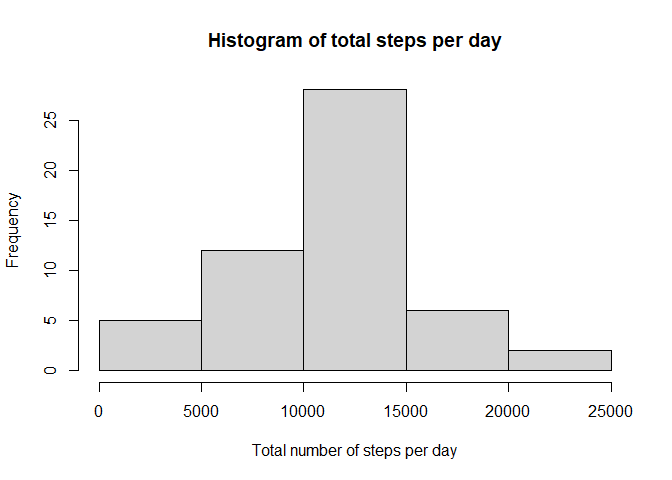
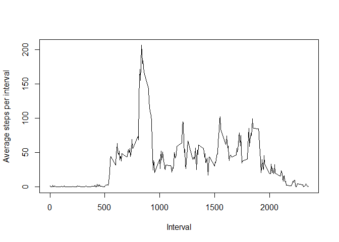
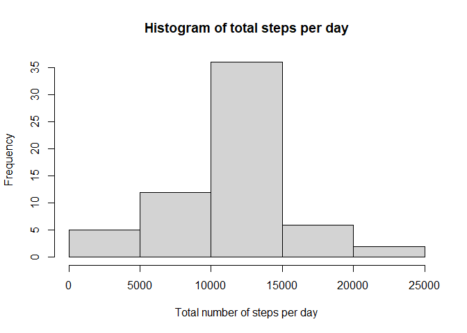
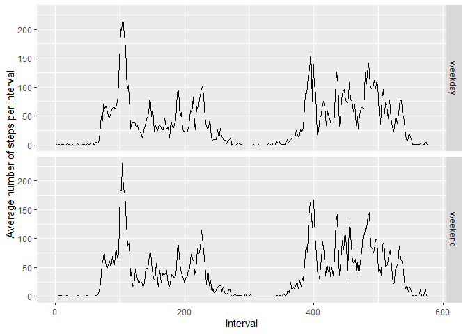

Load in the required libraries:

```r
library(dplyr)
library(ggplot2)
```

## Loading and preprocessing the data

With the *activity.csv* file in the working directory, we read it into R.
We then transform the date column from *character* type to *POSIXct* type for better graphing.


```r
data <- read.csv("activity.csv")
data <- transform(data, date = as.POSIXct(date, format = "%Y-%m-%d"))
```

## What is mean total number of steps taken per day?

After removing NA values, we calculate the total number of steps taken per day, presenting it in a histogram.


```r
data_noNA <- data[!is.na(data$steps), ]
total_steps_per_day <- tapply(data_noNA$steps, data_noNA$date, sum)
hist(total_steps_per_day, xlab = "Total number of steps per day", main = "Histogram of total steps per day")
```

<!-- -->

```r
mean <- mean(total_steps_per_day)
median <- median(total_steps_per_day)
```
We also calculate that the mean and median total number of steps per day is 10766.19 and 10765 respectively.

## What is the average daily activity pattern?
Here we calculate the number of steps for each interval, averaged across all days, then create a time-series plot.

```r
mean_steps_per_interval <- tapply(data_noNA$steps, data_noNA$interval, mean)
plot(as.integer(names(mean_steps_per_interval)), mean_steps_per_interval, type = "l",
     xlab = "Interval", ylab = "Average steps per interval")
```

<!-- -->

```r
max_interval <- names(mean_steps_per_interval)[which.max(mean_steps_per_interval)]
```
We calculate the 835 interval as the interval with the highest average step count.

## Imputing missing values

We impute the missing values by assigning it the value of the interval mean.

```r
total_NA <- sum(!complete.cases(data))
data_per_interval <- split(data, data$interval)
for (i in seq_along(data_per_interval)) {
        interval <- data_per_interval[[i]]
        interval_mean <- mean(interval$steps, na.rm = TRUE)
        data_per_interval[[i]]$steps <- replace(interval$steps, is.na(interval$steps), interval_mean)
}
data_imputed <- as.data.frame(bind_rows(data_per_interval))
```

2304 missing values were imputed.  
We repeat the code from the first part of the assignment:  


```r
total_steps_per_day_imputed <- tapply(data_imputed$steps, data_imputed$date, sum)
hist(total_steps_per_day_imputed, xlab = "Total number of steps per day", main = "Histogram of total steps per day")
```

<!-- -->

```r
mean_imputed <- mean(total_steps_per_day_imputed)
median_imputed <- median(total_steps_per_day_imputed)
```
As we can see, the histogram remains relatively unchanged. The new mean and median are also nearly identical at 10766.19 and 10766.19 respectively.

## Are there differences in activity patterns between weekdays and weekends?

Here, we split the imputed data by weekend/weekday. We can see there are minor differences in the average step patterns over the course of the day, but the overall pattern remains quite similar.


```r
data_imputed$day.type <- factor(weekdays(data_imputed$date) %in% c("Saturday", "Sunday") + 1, labels = c("weekday", "weekend"))
split_imputed <- split(data_imputed, data_imputed$day.type)
data_weekday <- split_imputed$weekday
data_weekend <- split_imputed$weekend
mean_steps_weekday <- tapply(data_weekday$steps, data_weekday$interval, mean)
mean_steps_weekend <- tapply(data_weekend$steps, data_weekend$interval, mean)
mean_steps <- c(mean_steps_weekday, mean_steps_weekend)
mean_steps_df <- data.frame(mean_steps)
mean_steps_df$day.type <- rep(c("weekday", "weekend"), length(mean_steps_per_interval))
mean_steps_df$interval <- as.integer(row.names(mean_steps_df))
row.names(mean_steps_df) <- c()
qplot(interval, mean_steps, data = mean_steps_df, facets = day.type ~ ., geom = "line",
      ylab = "Average number of steps per interval", xlab = "Interval")
```

<!-- -->
